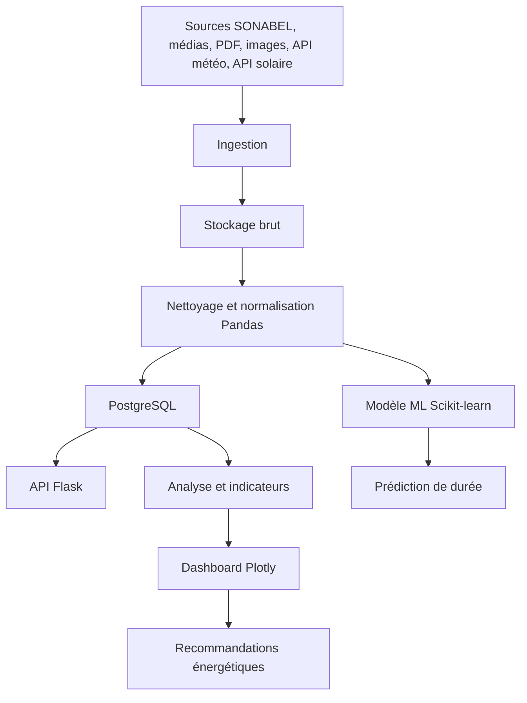

# Architecture technique

## Modules

1. **Ingestion** : scraping HTML, PDF, OCR, API météo, API solaire, API Banque mondiale.
2. **Processing** : nettoyage, normalisation des zones, calcul des durées, feature engineering.
3. **Database** : PostgreSQL pour stocker coupures, sources, signalements, notifications.
4. **Backend** : Flask pour l’application web et les endpoints API.
5. **Analytics** : indicateurs, graphiques et exports.
6. **ML** : Random Forest Regressor pour prédire la durée probable d’une coupure.
