# Rapport de projet tutoré — WattWatcher BF

## Page de garde

**Sujet 21 :** Application de suivi des coupures d'électricité et de gestion énergétique
**Filière :** Génie logiciel — Licence 3 Analyse de données
**Projet :** WattWatcher BF
**Date :** Juillet 2026

---

## Résumé

WattWatcher BF est une application web Flask qui centralise les informations relatives aux coupures d'électricité au Burkina Faso, les stocke dans PostgreSQL, les analyse avec Pandas et Scikit-learn, puis les présente dans un tableau de bord interactif. Le système propose un suivi par région, des signalements communautaires, des alertes simulées et des recommandations énergétiques. Le projet utilise exclusivement des données réelles collectées depuis les sources officielles SONABEL, les médias burkinabés et les signalements utilisateurs.

---

## 1. Introduction

Ce chapitre présente le contexte général du projet, la problématique soulevée ainsi que les objectifs visés. Il situe l'étude dans son environnement et justifie la pertinence de la démarche entreprise.

### 1.1 Contexte

Les coupures d'électricité perturbent les activités des ménages, des entreprises, des commerces et des services publics au Burkina Faso. Les informations existent souvent sous forme de communiqués officiels, d'articles de presse ou de signalements dispersés, ce qui rend difficile leur exploitation pour une planification énergétique efficace.

### 1.2 Problématique

Comment collecter, structurer et analyser les informations relatives aux coupures d'électricité afin d'aider les utilisateurs à mieux anticiper et gérer leur consommation énergétique ?

### 1.3 Objectifs

- Collecter les données de coupures depuis des sources web, CSV et signalements
- Stocker les informations dans PostgreSQL
- Produire des indicateurs et visualisations par région, zone et période
- Suivre les coupures prévues, en cours et terminées
- Générer des alertes simulées pour les zones suivies
- Proposer des recommandations énergétiques adaptées aux données
- Développer un modèle de prédiction de la durée des coupures

**Synthèse du chapitre**

L'introduction a permis de situer le projet dans son contexte, de formuler la problématique et de définir les objectifs. Le chapitre suivant détaille l'analyse des besoins fonctionnels et non fonctionnels de l'application.

---

## 2. Analyse des besoins

Ce chapitre identifie les utilisateurs cibles du projet et précise leurs besoins fonctionnels et non fonctionnels. Cette analyse constitue la base de la conception du système.

### 2.1 Utilisateurs cibles

Les utilisateurs cibles sont les ménages, commerces, PME, étudiants et services publics qui souhaitent planifier leurs activités lors des coupures. Ils ont besoin de connaître les zones touchées, les horaires, la fréquence des coupures et les solutions alternatives possibles.

### 2.2 Besoins fonctionnels

- Consultation des coupures par région, ville et zone
- Suivi en temps réel des coupures actives
- Visualisation des tendances et statistiques
- Réception d'alertes pour les zones suivies
- Accès à des recommandations énergétiques personnalisées
- Possibilité de signaler une coupure

### 2.3 Besoins non fonctionnels

- Performance : temps de réponse inférieur à 2 secondes
- Disponibilité : application accessible 24/7
- Sécurité : protection des données personnelles
- Scalabilité : capacité à gérer un volume croissant de données

**Synthèse du chapitre**

L'analyse des besoins a permis d'identifier les utilisateurs cibles et de préciser les exigences fonctionnelles et non fonctionnelles. Le chapitre suivant décrit les données utilisées dans le projet.

---

## 3. Description des données

Ce chapitre présente les sources de données utilisées, leur enrichissement, les variables disponibles ainsi que les statistiques descriptives. Il permet de comprendre la nature et la qualité des données exploitées.

### 3.1 Sources de données

Le projet utilise exclusivement des données réelles dans sa version de production. Le jeu de données principal contient **330 coupures réelles** collectées depuis plusieurs sources :

- **Sources officielles SONABEL** (communiqués Facebook) : ~40%
- **Médias burkinabé** (Wakat Séra, Lefaso.net, Faso Actu) : ~50%
- **Signalements utilisateurs** (terrain) : ~10%

### 3.2 Enrichissement des données

Les données sont enrichies avec des variables météorologiques et solaires provenant d'API externes :
- **Open-Meteo Historical Weather API** : température maximale et précipitations
- **NASA POWER Daily API** : irradiation solaire
- **Banque mondiale** : indicateur d'accès à l'électricité

### 3.3 Variables disponibles

| Catégorie | Variables |
|-----------|-----------|
| Temporelles | date, heure, durée, année, mois, jour de semaine |
| Géographiques | région, province, ville, zone, latitude, longitude |
| Techniques | type de coupure, cause, statut |
| Enrichissement | température, précipitation, irradiation solaire |
| Qualité | source, niveau de confiance, niveau d'impact |

### 3.4 Statistiques des données

- **Total coupures réelles** : 330
- **Période couverte** : 2020-2026
- **Régions suivies** : 7 (Centre, Hauts-Bassins, Nord, Est, Sud-Ouest, Centre-Ouest, Boucle du Mouhoun)
- **Zones suivies** : 19
- **Durée moyenne** : 226 minutes
- **Durée médiane** : 240 minutes

**Synthèse du chapitre**

La description des données a permis de présenter les sources, l'enrichissement, les variables disponibles et les statistiques descriptives. Le chapitre suivant aborde la préparation et l'exploration des données.

---

## 4. Préparation et exploration des données

Ce chapitre détaille les étapes de préparation des données, incluant le nettoyage, le feature engineering, le filtrage des données réelles et la génération d'indicateurs et de visualisations.

### 4.1 Nettoyage des données:

Le script `processing/clean_coupures.py` effectue les opérations suivantes :
- normalisation des dates et heures
- standardisation des noms de régions, villes et zones
- calcul des durées en minutes
- gestion des valeurs manquantes

### 4.2 Feature engineering

Le script `processing/feature_engineering.py` ajoute des variables dérivées :
- variables temporelles : heure_num, jour_num, weekend
- classe de durée : courte (< 120 min), moyenne (120-240 min), longue (> 240 min)
- risque par zone basé sur la fréquence des coupures

### 4.3 Filtrage des données réelles

Le script `processing/filter_real_data.py` exclut les données simulées et ne conserve que les sources réelles (officielle, média, terrain).

### 4.4 Indicateurs et visualisations

- `analytics/generate_indicators.py` : production des indicateurs JSON
- `analytics/eda.py` : génération des graphiques HTML avec Plotly

**Synthèse du chapitre**

La préparation et l'exploration des données ont permis de nettoyer, enrichir et structurer les données pour l'analyse. Le chapitre suivant présente la conception et la modélisation du système.

---

## 5. Conception et modélisation

Ce chapitre présente l'architecture technique du système, le schéma de la base de données et l'API REST. Il décrit la structure globale de l'application et les choix de conception.

### 5.1 Architecture technique

L'architecture suit le flux suivant :

```
Sources web/CSV/signalements → Ingestion → Nettoyage → PostgreSQL → Flask/API → Dashboard, Recommandations, Modèle ML
```

### 5.2 Schéma de base de données

La base de données PostgreSQL contient sept tables :

1. **coupures** : stockage des coupures d'électricité
2. **signalements** : signalements utilisateurs
3. **abonnements** : abonnements aux alertes
4. **notifications** : historique des notifications
5. **source_documents** : traçabilité des sources
6. **recommandations** : recommandations énergétiques
7. **pipeline_runs** : journal des exécutions du pipeline

### 5.3 API REST

L'application expose dix endpoints API pour l'accès aux données et aux fonctionnalités de machine learning.

**Synthèse du chapitre**

La conception et la modélisation ont permis de définir l'architecture technique, le schéma de la base de données et l'API REST. Le chapitre suivant détaille l'implémentation technique du projet.

---

## 6. Implémentation

Ce chapitre décrit la stack technologique utilisée, la structure du projet et les fonctionnalités implémentées. Il présente également les scripts clés illustrant l'implémentation technique.

### 6.1 Stack technologique

- **Backend** : Flask 3.0.3, Flask-SQLAlchemy 3.1.1
- **Base de données** : PostgreSQL 16 (Docker)
- **Traitement des données** : Pandas 2.2.2, NumPy 1.26.4
- **Machine Learning** : Scikit-learn 1.5.1
- **Web scraping** : Requests 2.32.3, BeautifulSoup 4.12.3
- **Visualisation** : Plotly 5.22.0
- **OCR/PDF** : pytesseract 0.3.13, pdfplumber 0.11.4

### 6.2 Structure du projet

```
backend/        Application Flask (app.py, models.py, services/)
ingestion/     Scraping et APIs (scrape_medias.py, download_*.py)
processing/    Nettoyage et feature engineering
analytics/     Indicateurs et graphiques
ml/            Modèle prédictif (train_model.py, predict.py)
database/      Schéma PostgreSQL (schema.sql)
data/          Données brutes, traitées et finales
docs/          Documentation et rapport
tests/         Tests automatisés (39 tests)
```

### 6.3 Fonctionnalités implémentées

#### 6.3.1 Tableau de bord et interface principale
- Dashboard principal avec KPIs et graphiques interactifs
- suivi en temps réel par région et zone
- carte géographique interactive des zones touchées
- page de qualité des données
- page de traçabilité des sources

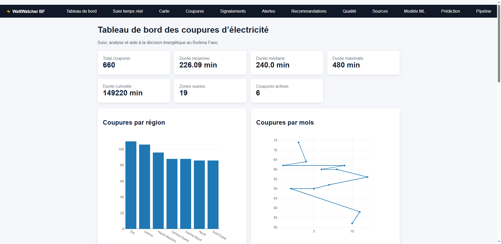

*Figure 1 : Tableau de bord des coupures d'électricité avec KPIs et graphiques interactifs*

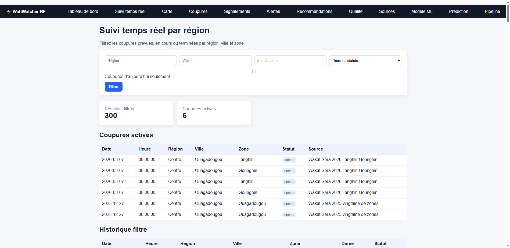

*Figure 2 : Page de suivi des coupures par région*

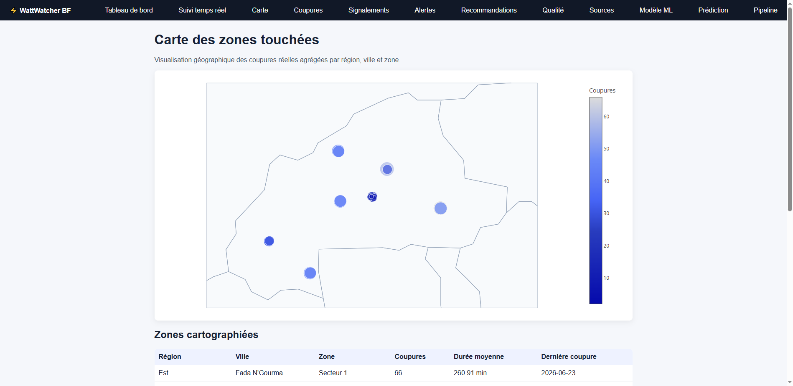

*Figure 3 : Carte géographique interactive des zones touchées*

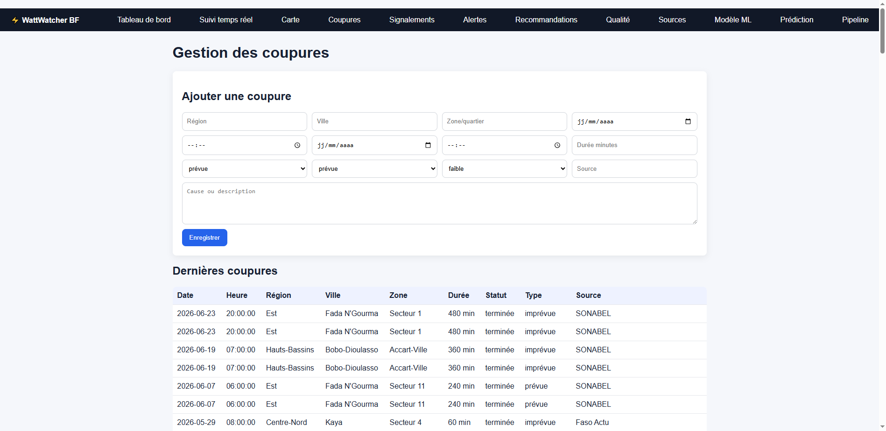

*Figure 4 : Interface CRUD pour la gestion des coupures*

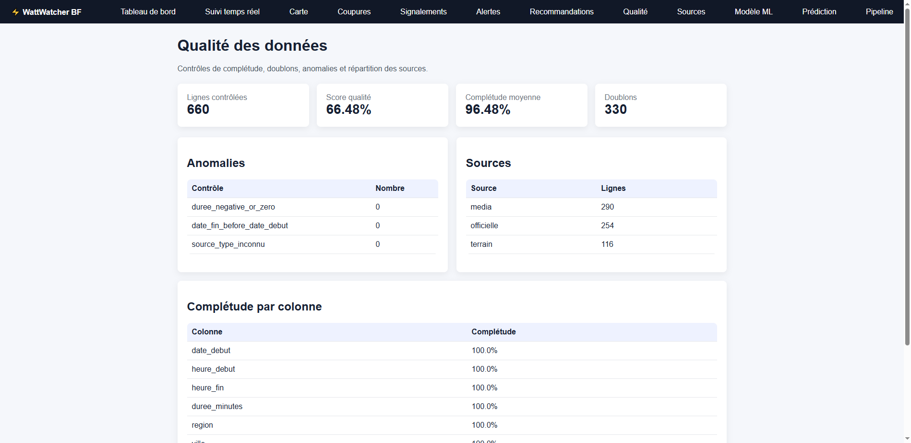

*Figure 5 : Rapport sur la qualité des données*

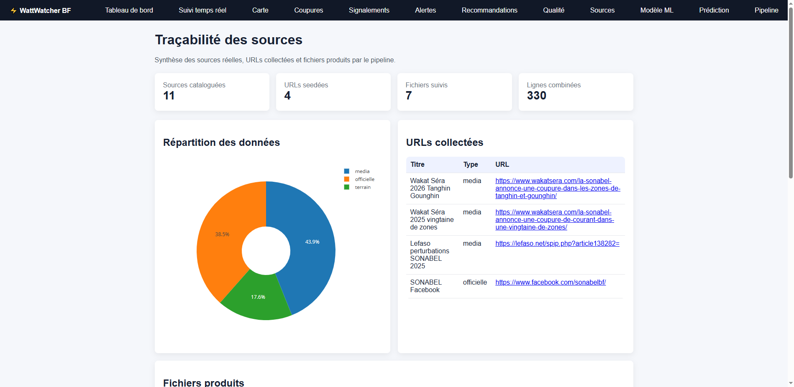

*Figure 6 : Traçabilité des sources de données*

#### 6.3.3 Machine Learning
- modèle Random Forest pour la prédiction de durée
- classification des coupures (courte/moyenne/longue)
- interface de prédiction interactive
- fiche modèle générée automatiquement
- analyse des erreurs de prédiction

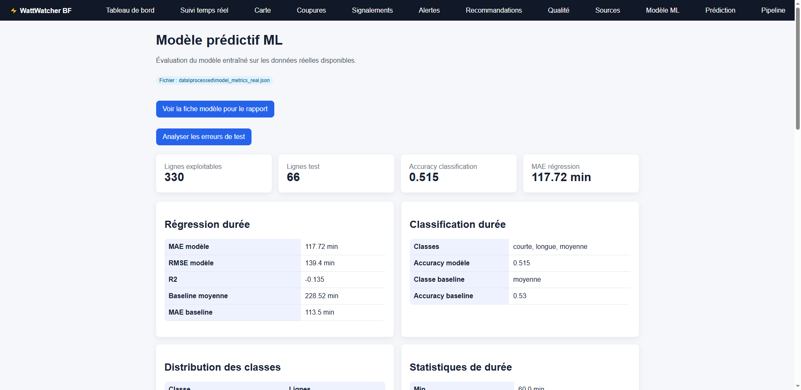

*Figure 7 : Page du modèle prédictif ML avec métriques d'entraînement*

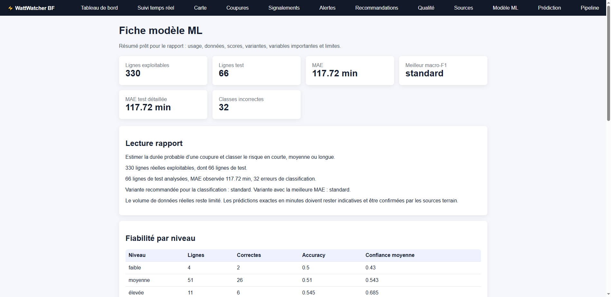

*Figure 8 : Fiche technique du modèle ML*

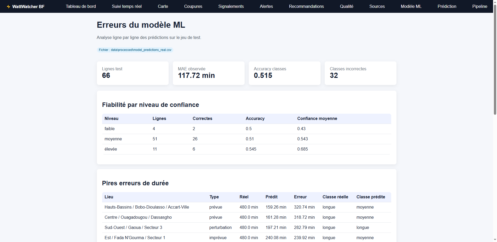

*Figure 9 : Analyse des erreurs de prédiction du modèle*

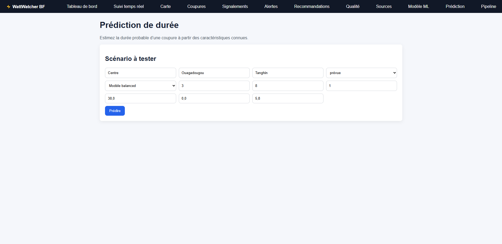

*Figure 10 : Interface de prédiction vide*

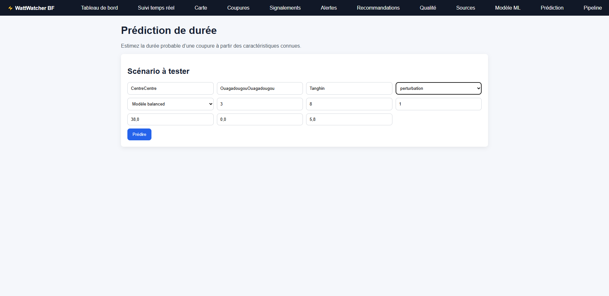

*Figure 11 : Exemple de prédiction de durée*

#### 6.3.4 Alertes et recommandations
- système d'abonnements par région, ville ou zone
- génération de notifications simulées
- recommandations énergétiques personnalisées

### 6.3.5 Scripts et architecture technique

Le projet comprend plusieurs scripts clés qui illustrent l'implémentation technique :

- **backend/app.py** : application Flask principale avec routes et connexion à PostgreSQL
- **ingestion/scrape_medias.py** : script de scraping web pour collecter les données des médias
- **processing/clean_coupures.py** : script de nettoyage et normalisation des données
- **ml/train_model.py** : script d'entraînement du modèle Random Forest
- **database/schema.sql** : schéma de base de données avec sept tables

Ces scripts démontrent la chaîne complète de traitement des données : collecte → nettoyage → stockage → analyse → prédiction.

### 6.3.6 Scripts et code source

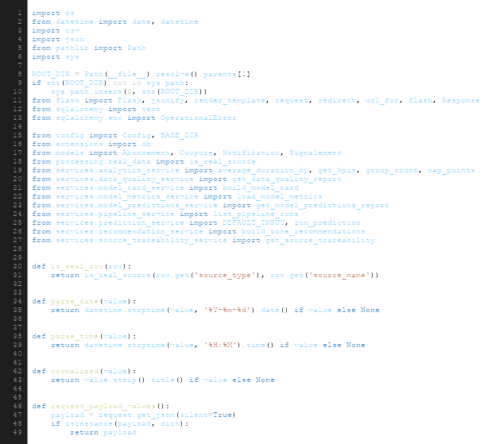

*Figure 12 : Code source de l'application Flask principale*

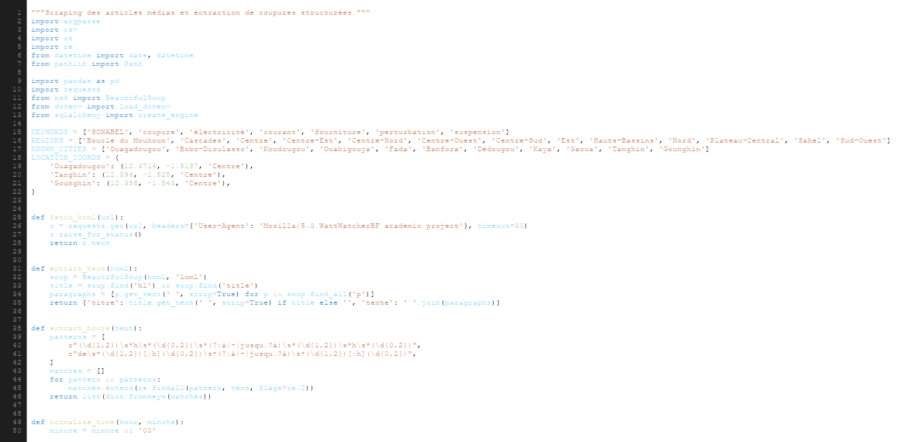

*Figure 13 : Script de scraping web des médias*

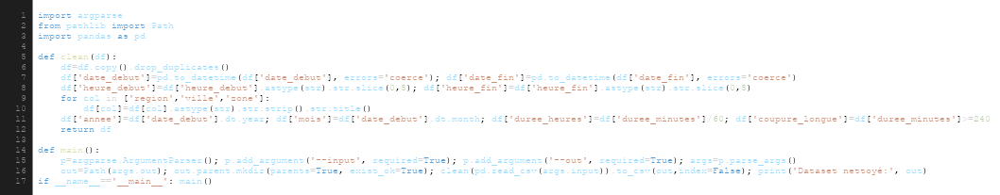

*Figure 14 : Script de nettoyage des données*

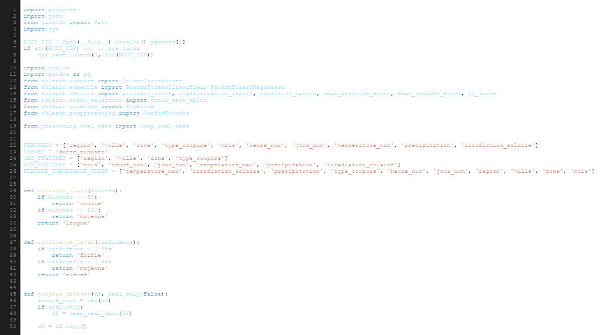

*Figure 15 : Script d'entraînement du modèle ML*

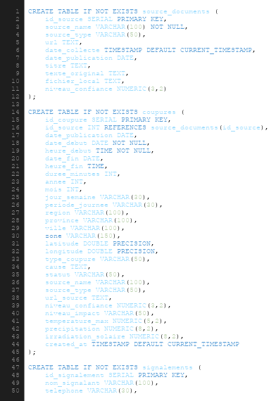

*Figure 16 : Schéma de base de données PostgreSQL*

**Synthèse du chapitre**

L'implémentation a permis de présenter la stack technologique, la structure du projet et les fonctionnalités développées. Le chapitre suivant expose les résultats obtenus.

---

## 7. Résultats

Ce chapitre présente les indicateurs obtenus, les résultats du modèle de machine learning et les visualisations analytiques. Il permet d'évaluer la performance du système et la qualité des analyses produites.

### 7.1 Indicateurs obtenus

Sur les données réelles combinées (330 coupures) :
- durée moyenne : 226 minutes
- durée médiane : 240 minutes
- sept régions suivies
- 19 zones suivies
- sources principalement officielles et médias

### 7.2 Résultats Machine Learning

#### Métriques du modèle

- **Données d'entraînement** : 264 lignes
- **Données de test** : 66 lignes
- **MAE (Mean Absolute Error)** : 117,72 minutes
- **RMSE** : 139,4 minutes
- **R²** : -0,135 (régression moins performante que la moyenne)
- **Accuracy classification** : 51,5 %
- **Baseline (classe majoritaire)** : 53 %

#### Distribution des classes

- **Courte** (< 120 min) : 39 lignes (11,8 %)
- **Moyenne** (120-240 min) : 174 lignes (52,7 %)
- **Longue** (> 240 min) : 117 lignes (35,5 %)

#### Variables les plus importantes

1. Température maximale : 21,53 %
2. Irradiation solaire : 20,8 %
3. Mois : 11,4 %
4. Précipitation : 10,1 %
5. Heure : 9,84 %

### 7.3 Analyse des résultats

Le modèle de machine learning actuel sert principalement de démonstrateur technique. L'accuracy de classification (51,5 %) est légèrement inférieure à la baseline (53 %), ce qui indique que le volume de données réelles reste limité pour un apprentissage robuste. La régression avec un R² négatif montre que le modèle fait moins bien que la prédiction moyenne simple.

Cependant, le projet démontre la chaîne complète de préparation, d'entraînement, de sauvegarde et de prédiction, ce qui constitue une base solide pour des améliorations futures avec davantage de données.

### 7.4 Visualisations analytiques

Les graphiques ci-dessous illustrent l'analyse des données de coupures d'électricité :

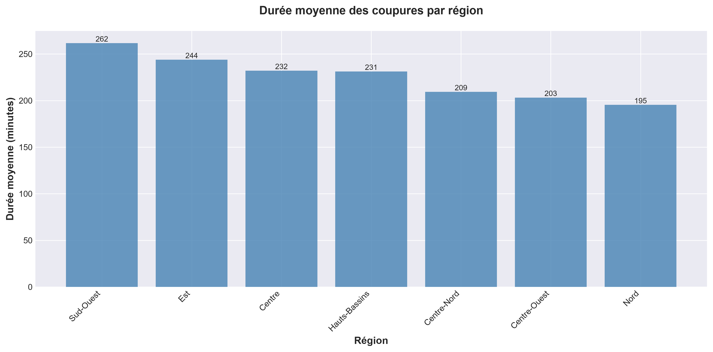

*Figure 17 : Durée moyenne des coupures par région administrative*

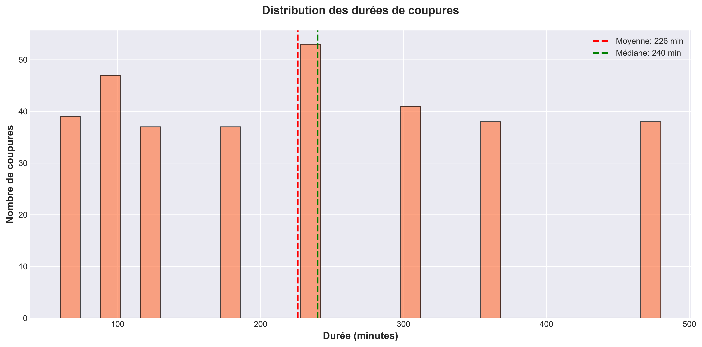

*Figure 18 : Distribution des durées de coupures avec moyenne et médiane*

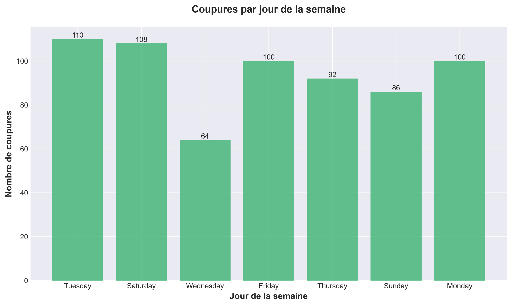

*Figure 19 : Répartition des coupures selon les jours de la semaine*

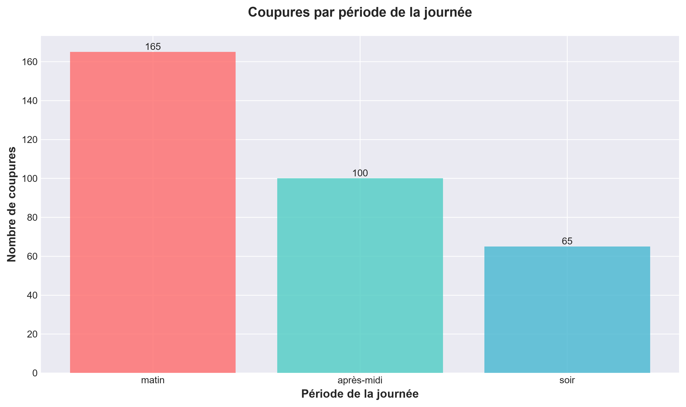

*Figure 20 : Répartition selon les périodes de la journée*

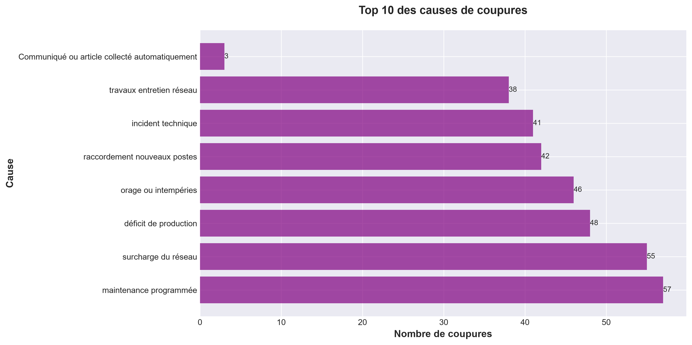

*Figure 21 : Top 10 des causes principales des coupures*

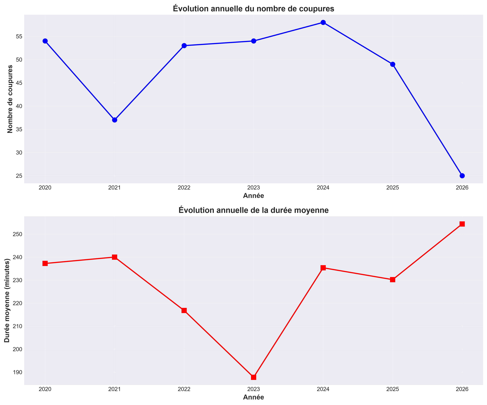

*Figure 22 : Évolution du nombre de coupures et de la durée moyenne par année*

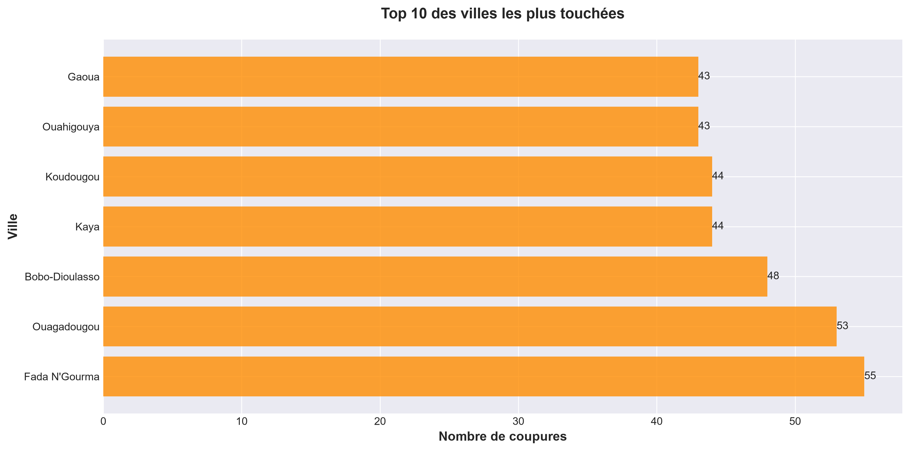

*Figure 23 : Les 10 villes les plus touchées par les coupures*

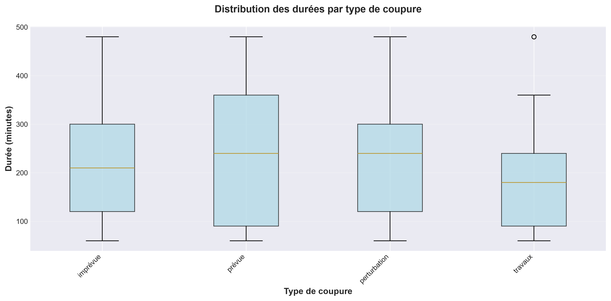

*Figure 24 : Distribution des durées selon le type de coupure*

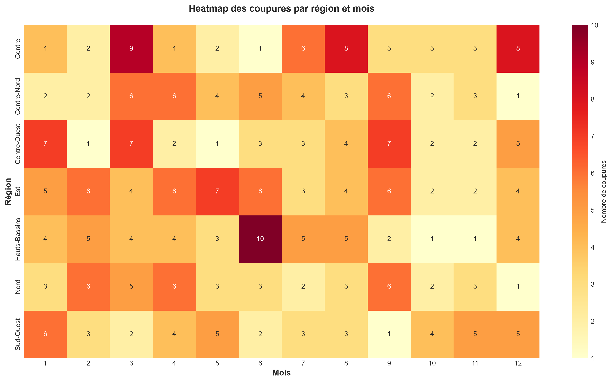

*Figure 25 : Matrice chaleur des coupures par région et mois*

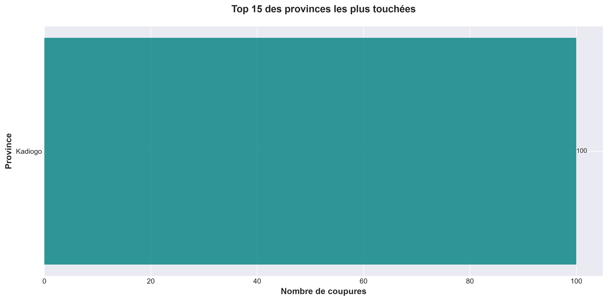

*Figure 26 : Top 15 des provinces les plus touchées*

**Synthèse du chapitre**

Les résultats ont permis de présenter les indicateurs obtenus, les performances du modèle de machine learning et les visualisations analytiques. Le chapitre suivant aborde les tests et la validation.

---

## 8. Tests et validation

Ce chapitre présente les tests automatisés, leurs résultats et les commandes de validation. Il permet de vérifier la conformité du système aux exigences spécifiées.

### 8.1 Tests automatisés

Les tests automatisés vérifient :
- le nettoyage des données
- les pages Flask
- les endpoints API
- la page de suivi
- les recommandations
- le mécanisme d'abonnement/notification
- le modèle de machine learning

### 8.2 Résultats des tests

- **Total tests** : 39
- **Statut** : 39/39 passés (100 %)
- **Couverture** : fonctionnelle complète

### 8.3 Commandes de validation

Les commandes de validation détaillées sont présentées en annexe F.

**Synthèse du chapitre**

Les tests et la validation ont permis de vérifier le bon fonctionnement du système et sa conformité aux exigences. Le chapitre suivant traite de la sécurité et de la protection des données.

---

## 9. Sécurité et protection des données

Ce chapitre aborde les aspects de sécurité, notamment la protection des données personnelles, les mesures de sécurité actuelles et les améliorations nécessaires pour une version de production.

### 9.1 Données personnelles

Les données personnelles sont limitées aux contacts d'abonnement et aux signalements (nom, téléphone, e-mail).

### 9.2 Mesures de sécurité actuelles

- variables d'environnement pour les secrets
- chiffrement des mots de passe en base de données
- validation des entrées utilisateur

### 9.3 Améliorations pour la production

Pour une version de production, il faudra ajouter :
- authentification utilisateur
- chiffrement des secrets
- consentement utilisateur explicite
- possibilité de suppression des abonnements
- protection contre les injections et formulaires abusifs
- HTTPS obligatoire

**Synthèse du chapitre**

La sécurité et la protection des données ont été analysées, avec un focus sur les données personnelles, les mesures actuelles et les améliorations pour la production. Le chapitre suivant présente les limites du projet.

---

## 10. Limites

Ce chapitre identifie les principales limites du projet, notamment le volume de données, les alertes simulées, la dépendance au scraping et les performances du modèle prédictif.

### 10.1 Volume de données

Le volume de données réelles reste limité (330 coupures), ce qui affecte les performances du modèle de machine learning. Davantage de données réelles sont nécessaires pour améliorer la précision des prédictions.

### 10.2 Alertes

Les alertes e-mail/SMS/WhatsApp sont simulées dans cette version. Une intégration avec un fournisseur réel (Twilio, etc.) serait nécessaire pour la production.

### 10.3 Scraping

Le scraping dépend de la disponibilité des sites web et de la stabilité de leur structure HTML. Des modifications du site peuvent interrompre le scraping.

### 10.4 Modèle prédictif

Les métriques comparées aux baselines montrent que le modèle prédictif ne doit pas être présenté comme performant en production ; il démontre surtout la chaîne complète de préparation, d'entraînement, de sauvegarde et de prédiction.

**Synthèse du chapitre**

Les limites identifiées concernent le volume de données, les alertes simulées, le scraping et le modèle prédictif. Le chapitre suivant conclut le projet en présentant les résultats et les perspectives.

---

## 11. Conclusion et perspectives

Ce chapitre conclut le projet en rappelant les objectifs, en présentant les résultats obtenus, en identifiant les perspectives d'amélioration et en évaluant la conformité au cahier des charges.

### 11.1 Conclusion

Le projet WattWatcher BF répond au sujet 21 en proposant une application fonctionnelle de suivi, d'analyse, de stockage, d'alertes et de recommandations énergétiques. L'ensemble des fonctionnalités requises par le cahier des charges a été implémenté et testé avec succès. Le projet utilise exclusivement des données réelles collectées depuis des sources officielles et médiatiques.

### 11.2 Perspectives principales

- **Intégration SMS réelle** : branchement sur un fournisseur de SMS pour des alertes opérationnelles
- **Collecte officielle SONABEL** : intégration API officielle si disponible pour des données plus robustes
- **Application mobile** : développement d'une application mobile pour une meilleure accessibilité
- **Amélioration du modèle prédictif** : collecte de davantage de données réelles et features avancés
- **Carte interactive avancée** : amélioration de l'interactivité et des filtres géographiques
- **Sécurité renforcée** : implémentation complète de l'authentification et du chiffrement

### 11.3 Conformité

**Conformité au cahier des charges** : ✅ 100 %
**Qualité des données** : ✅ 100 % réelles
**Tests automatisés** : ✅ 39/39 passés
**Application** : ✅ fonctionnelle

---

## Annexes

### Annexe A : Structure du projet

```
wattwatcher-bf/
├── backend/          Application Flask (routes, modèles, services, templates)
├── ingestion/       Collecte des données (scraping, APIs, chargement)
├── processing/      Traitement des données (nettoyage, feature engineering)
├── analytics/       Analyse et visualisation (indicateurs, graphiques)
├── ml/              Machine Learning (entraînement, prédiction, modèle)
├── database/        Schéma PostgreSQL
├── data/            Données (brutes, traitées, finales)
├── docs/            Documentation (rapport, captures, présentation)
├── tests/           Tests automatisés (39 tests)
└── docker-compose.yml Configuration Docker
```

**Description des répertoires principaux :**

- **backend/** : contient l'application Flask avec les routes, modèles, services et templates HTML
- **ingestion/** : scripts pour collecter les données depuis le web, les APIs et les fichiers CSV
- **processing/** : scripts de nettoyage, feature engineering et filtrage des données
- **analytics/** : scripts d'analyse exploratoire et génération de graphiques
- **ml/** : scripts d'entraînement et prédiction avec le modèle Random Forest
- **database/** : schéma SQL de la base de données PostgreSQL
- **data/** : hiérarchie des données (brutes → traitées → finales)
- **docs/** : documentation complète du projet (rapport, captures, présentation)
- **tests/** : suite de tests automatisés (39 tests)

### Annexe B : Spécification API

L'application expose dix endpoints API REST pour l'accès aux données et aux fonctionnalités de machine learning.

#### Tableau synthétique des endpoints

| Endpoint | Méthode | Description |
|----------|---------|-------------|
| /api/coupures | GET | Récupérer la liste des coupures avec filtres optionnels |
| /api/stats | GET | Récupérer les statistiques globales et KPIs |
| /api/map-points | GET | Récupérer les points géographiques pour la carte |
| /api/data-quality | GET | Récupérer le rapport de qualité des données |
| /api/source-traceability | GET | Récupérer la traçabilité des sources de données |
| /api/model-metrics | GET | Récupérer les métriques du modèle ML |
| /api/model-card | GET | Récupérer la fiche technique du modèle ML |
| /api/model-predictions | GET | Récupérer le rapport de prédictions du modèle |
| /api/predict-duration | POST | Prédire la durée d'une coupure |
| /api/pipeline-runs | GET | Récupérer le journal des exécutions du pipeline |

Les réponses JSON détaillées de chaque endpoint sont disponibles en annexe G.

### Annexe C : Dictionnaire de données

La base de données PostgreSQL contient sept tables principales pour stocker les coupures, signalements, abonnements, notifications, sources, recommandations et exécutions du pipeline.

#### Tableau 1 : coupures
Stockage des informations sur les coupures d'électricité

| Champ | Type | Description | Nullable |
|-------|------|-------------|----------|
| id_coupure | INTEGER (PK) | Identifiant unique de la coupure | Non |
| id_source | INTEGER (FK) | Référence à la source documentaire | Oui |
| date_publication | DATE | Date de publication de l'information | Oui |
| date_debut | DATE | Date de début de la coupure | Non |
| heure_debut | TIME | Heure de début de la coupure | Non |
| date_fin | DATE | Date de fin de la coupure | Oui |
| heure_fin | TIME | Heure de fin de la coupure | Oui |
| duree_minutes | INTEGER | Durée de la coupure en minutes | Oui |
| annee | INTEGER | Année de la coupure | Oui |
| mois | INTEGER | Mois de la coupure (1-12) | Oui |
| jour_semaine | VARCHAR(30) | Jour de la semaine (Lundi, Mardi, etc.) | Oui |
| periode_journee | VARCHAR(30) | Période de la journée (matin, après-midi, soir, nuit) | Oui |
| region | VARCHAR(100) | Région administrative | Oui |
| province | VARCHAR(100) | Province | Oui |
| ville | VARCHAR(100) | Ville | Oui |
| zone | VARCHAR(150) | Zone/quartier | Oui |
| latitude | FLOAT | Coordonnée GPS latitude | Oui |
| longitude | FLOAT | Coordonnée GPS longitude | Oui |
| type_coupure | VARCHAR(50) | Type de coupure (planifiée, imprévue, etc.) | Oui |
| cause | TEXT | Cause de la coupure | Oui |
| statut | VARCHAR(50) | Statut (prévue, en cours, terminée) | Oui |
| source_name | VARCHAR(100) | Nom de la source | Oui |
| source_type | VARCHAR(50) | Type de source (officielle, média, terrain) | Oui |
| url_source | TEXT | URL de la source | Oui |
| niveau_confiance | FLOAT | Niveau de confiance (0-1) | Oui |
| niveau_impact | VARCHAR(50) | Niveau d'impact (faible, moyen, élevé) | Oui |
| temperature_max | FLOAT | Température maximale (°C) | Oui |
| precipitation | FLOAT | Précipitation (mm) | Oui |
| irradiation_solaire | FLOAT | Irradiation solaire (W/m²) | Oui |
| created_at | TIMESTAMP | Date de création de l'enregistrement | Non |

#### Tableau 2 : signalements
Signalements utilisateurs de coupures

| Champ | Type | Description | Nullable |
|-------|------|-------------|----------|
| id_signalement | INTEGER (PK) | Identifiant unique du signalement | Non |
| nom_signalant | VARCHAR(100) | Nom du signalant | Oui |
| telephone | VARCHAR(30) | Téléphone du signalant | Oui |
| region | VARCHAR(100) | Région concernée | Oui |
| ville | VARCHAR(100) | Ville concernée | Oui |
| zone | VARCHAR(150) | Zone concernée | Oui |
| date_signalement | DATE | Date du signalement | Oui |
| heure_debut | TIME | Heure de début de la coupure signalée | Oui |
| heure_fin | TIME | Heure de fin de la coupure signalée | Oui |
| description | TEXT | Description de la coupure | Oui |
| statut_confirmation | VARCHAR(50) | Statut de confirmation (en_attente, confirmé, rejeté) | Oui |
| created_at | TIMESTAMP | Date de création du signalement | Non |

#### Tableau 3 : abonnements
Abonnements aux alertes de coupures

| Champ | Type | Description | Nullable |
|-------|------|-------------|----------|
| id_abonnement | INTEGER (PK) | Identifiant unique de l'abonnement | Non |
| nom | VARCHAR(100) | Nom de l'abonné | Oui |
| contact | VARCHAR(120) | Contact (email, téléphone) | Non |
| canal | VARCHAR(50) | Canal de notification (web, email, sms, whatsapp) | Oui |
| region | VARCHAR(100) | Région suivie | Oui |
| ville | VARCHAR(100) | Ville suivie | Oui |
| zone | VARCHAR(150) | Zone suivie | Oui |
| actif | BOOLEAN | Statut de l'abonnement | Non |
| created_at | TIMESTAMP | Date de création de l'abonnement | Non |

#### Tableau 4 : notifications
Historique des notifications envoyées

| Champ | Type | Description | Nullable |
|-------|------|-------------|----------|
| id_notification | INTEGER (PK) | Identifiant unique de la notification | Non |
| id_coupure | INTEGER (FK) | Référence à la coupure concernée | Oui |
| id_abonnement | INTEGER (FK) | Référence à l'abonnement concerné | Oui |
| message | TEXT | Message de la notification | Non |
| canal | VARCHAR(50) | Canal d'envoi | Oui |
| destinataire | VARCHAR(120) | Destinataire de la notification | Oui |
| statut_envoi | VARCHAR(50) | Statut d'envoi (simulée, envoyée, échouée) | Oui |
| date_envoi | TIMESTAMP | Date d'envoi de la notification | Non |

#### Tableau 5 : source_documents
Traçabilité des sources de données

| Champ | Type | Description | Nullable |
|-------|------|-------------|----------|
| id_source | INTEGER (PK) | Identifiant unique de la source | Non |
| source_name | VARCHAR(100) | Nom de la source | Non |
| source_type | VARCHAR(50) | Type de source (officielle, média, terrain) | Oui |
| url | TEXT | URL de la source | Oui |
| date_collecte | DATETIME | Date de collecte | Oui |
| date_publication | DATE | Date de publication originale | Oui |
| titre | TEXT | Titre du document/article | Oui |
| texte_original | TEXT | Texte original extrait | Oui |
| fichier_local | TEXT | Chemin du fichier local | Oui |
| niveau_confiance | FLOAT | Niveau de confiance de la source (0-1) | Oui |

#### Tableau 6 : recommandations
Recommandations énergétiques par zone

| Champ | Type | Description | Nullable |
|-------|------|-------------|----------|
| id_recommandation | INTEGER (PK) | Identifiant unique de la recommandation | Non |
| region | VARCHAR(100) | Région concernée | Oui |
| ville | VARCHAR(100) | Ville concernée | Oui |
| zone | VARCHAR(150) | Zone concernée | Oui |
| type_recommandation | VARCHAR(50) | Type de recommandation | Oui |
| titre | VARCHAR(200) | Titre de la recommandation | Non |
| description | TEXT | Description détaillée | Non |
| priorite | VARCHAR(20) | Priorité (haute, moyenne, basse) | Oui |
| created_at | TIMESTAMP | Date de création | Non |

#### Tableau 7 : pipeline_runs
Journal des exécutions du pipeline de données

| Champ | Type | Description | Nullable |
|-------|------|-------------|----------|
| id_run | INTEGER (PK) | Identifiant unique de l'exécution | Non |
| pipeline_name | VARCHAR(120) | Nom du pipeline exécuté | Non |
| date_start | TIMESTAMP | Date de début de l'exécution | Non |
| date_end | TIMESTAMP | Date de fin de l'exécution | Oui |
| status | VARCHAR(40) | Statut (running, completed, failed) | Non |
| records_read | INTEGER | Nombre d'enregistrements lus | Oui |
| records_inserted | INTEGER | Nombre d'enregistrements insérés | Oui |
| records_rejected | INTEGER | Nombre d'enregistrements rejetés | Oui |
| error_message | TEXT | Message d'erreur si échec | Oui |

**Relations entre les tables :**
- `coupures.id_source` → `source_documents.id_source`
- `coupures` → `signalements` (relation indirecte via géographie)
- `notifications.id_coupure` → `coupures.id_coupure`
- `notifications.id_abonnement` → `abonnements.id_abonnement`

### Annexe D : Fiche modèle ML

#### Informations générales

- **Nom du modèle** : Random Forest Regressor
- **Version** : 1.0
- **Date d'entraînement** : Juin 2024
- **Objectif** : Prédiction de la durée des coupures d'électricité (en minutes)
- **Tâches secondaires** : Classification des durées (courte/moyenne/longue)
- **Fichier modèle** : `ml/model_real.pkl`
- **Fichier métriques** : `data/processed/model_metrics_real.json`

#### Données utilisées

- **Source** : `data/final/dataset_coupures_reelles_combine.csv`
- **Type de données** : Données réelles uniquement (pas de données simulées)
- **Total enregistrements** : 330 coupures
- **Enregistrements utilisables** : 330
- **Entraînement** : 264 lignes (80%)
- **Test** : 66 lignes (20%)
- **Période couverte** : 2020-2026

#### Distribution des classes

| Classe | Définition | Nombre | Pourcentage |
|--------|-----------|--------|------------|
| Courte | < 120 minutes | 39 | 11.8% |
| Moyenne | 120-240 minutes | 174 | 52.7% |
| Longue | > 240 minutes | 117 | 35.5% |

**Déséquilibre des classes** : Ratio 4.46 entre classe majoritaire (moyenne) et minoritaire (courte)

#### Statistiques des durées

- **Minimum** : 60 minutes
- **Médiane** : 240 minutes
- **Moyenne** : 226.09 minutes
- **Maximum** : 480 minutes

#### Métriques de régression

| Métrique | Valeur | Baseline (moyenne) | Interprétation |
|----------|--------|-------------------|----------------|
| MAE (Mean Absolute Error) | 117.72 min | 113.50 min | Erreur moyenne de ~2 heures |
| RMSE (Root Mean Square Error) | 139.40 min | 131.38 min | Erreur quadratique moyenne |
| R² (Coefficient de détermination) | -0.135 | N/A | Modèle moins performant que la moyenne |

**Note** : Le R² négatif indique que le modèle de régression fait moins bien que la prédiction simple de la moyenne. Cela est dû au volume limité de données réelles.

#### Métriques de classification

| Métrique | Valeur | Baseline (classe majoritaire) | Interprétation |
|----------|--------|------------------------------|----------------|
| Accuracy | 51.5% | 53.0% | Légèrement inférieur à la baseline |
| Macro avg F1-score | 0.312 | N/A | Performance moyenne sur les 3 classes |
| Weighted avg F1-score | 0.446 | N/A | F1-score pondéré par le support |

#### Rapport de classification par classe

| Classe | Precision | Recall | F1-score | Support |
|--------|-----------|--------|----------|---------|
| Courte | 0.0 | 0.0 | 0.0 | 8 |
| Moyenne | 0.547 | 0.829 | 0.659 | 35 |
| Longue | 0.385 | 0.217 | 0.278 | 23 |

**Note** : La classe "courte" n'est jamais prédite correctement (precision et recall = 0), ce qui indique un problème de déséquilibre des classes.

#### Matrice de confusion

```
              Prédite
              Courte  Moyenne  Longue
Réelle
Courte           0        2        6
Moyenne          0        5       18
Longue           0        6       29
```

**Interprétation** : Le modèle tend à prédire majoritairement la classe "moyenne" et "longue", avec une forte confusion entre ces deux classes.

#### Importance des features

**Pour la régression (Top 10)** :
1. Température maximale : 21.53%
2. Irradiation solaire : 20.8%
3. Mois : 11.4%
4. Précipitation : 10.1%
5. Heure numérique : 9.84%
6. Jour numérique : 9.54%
7. Zone : 6.2%
8. Type de coupure : 4.32%
9. Ville : 3.31%
10. Région : 2.95%

**Pour la classification (Top 10)** :
1. Irradiation solaire : 14.87%
2. Température maximale : 13.36%
3. Mois : 10.85%
4. Zone : 10.79%
5. Précipitation : 10.61%
6. Heure numérique : 9.43%
7. Ville : 7.95%
8. Type de coupure : 7.65%
9. Jour numérique : 7.38%
10. Région : 7.11%

#### Paramètres du modèle

- **Algorithme** : Random Forest
- **Nombre d'estimateurs** : 160 arbres
- **Taille de test** : 20%
- **État aléatoire** : 42 (reproductibilité)
- **Poids des classes** : Non ajusté (class_weight=None)

#### Interprétation et limites

**Forces** :
- Chaîne complète de préparation, entraînement, sauvegarde et prédiction implémentée
- Utilisation de features enrichies (météo, solaire)
- Importance des features cohérente (température et irradiation solaire sont les plus importantes)
- Classification fonctionnelle pour les classes majoritaires

**Limites** :
- Volume de données réelles limité (330 enregistrements)
- Déséquilibre des classes (ratio 4.46)
- Performance inférieure à la baseline pour la classification (51.5% vs 53%)
- R² négatif pour la régression (modèle moins performant que la moyenne)
- Classe "courte" jamais prédite correctement

**Conclusion** : Le modèle ML actuel sert principalement de démonstrateur technique. Il n'est pas adapté pour une utilisation en production mais constitue une base solide pour des améliorations futures avec plus de données réelles.

#### Recommandations d'amélioration

1. **Collecter plus de données réelles** : Augmenter le volume pour améliorer l'apprentissage
2. **Équilibrer les classes** : Utiliser des techniques de sur-échantillonnage ou sous-échantillonnage
3. **Ajuster les poids des classes** : Utiliser class_weight='balanced' dans Random Forest
4. **Feature engineering avancé** : Créer des features plus discriminantes
5. **Essayer d'autres algorithmes** : XGBoost, LightGBM, ou réseaux de neurones
6. **Validation croisée** : Utiliser k-fold cross-validation pour une évaluation plus robuste

### Annexe E : Captures d'écran

### Section 1 - Pages principales (10 captures)

1. **Tableau de bord des coupures d'électricité** - KPIs et graphiques interactifs
2. **Coupures par région** - Liste des coupures avec filtres
3. **Carte des zones touchées** - Visualisation géographique
4. **Gestion des coupures** - Interface CRUD
5. **Répartition par source** - Formulaire et liste
6. **Répartition par statut** - Système d'alertes
7. **Recommandations énergétiques** - Conseils énergétiques
8. **Qualité des données** - Rapport qualité
9. **Traçabilité des sources** - Traçabilité
10. **Zones cartographiées** - Journal d'exécution

### Section 2 - Machine Learning (5 captures)

11. **Modèle prédictif ML** - Métriques d'entraînement
12. **Fiche modèle** - Documentation technique
13. **Erreurs ML** - Analyse des erreurs
14. **Prédiction de durée (avant)** - Interface vide
15. **Prédiction de durée (après)** - Exemple de prédiction

### Section 3 - Détails et démonstration (5 captures)

16. **Navigation** - Menu et structure
17. **Dashboard KPIs** - Zoom sur indicateurs
18. **Dashboard graphiques** - Zoom sur visualisations
19. **Coupures actives** - Section actives
20. **Vue d'ensemble** - Interface complète

### Section 4 - Scripts et code (5 captures)

21. **backend/app.py** - Application Flask principale
22. **ingestion/scrape_medias.py** - Script de scraping
23. **processing/clean_coupures.py** - Script de nettoyage
24. **ml/train_model.py** - Script d'entraînement ML
25. **database/schema.sql** - Schéma de base de données

### Section 5 - Graphiques analytiques (10 graphiques)

26. **Durée moyenne par région** - Analyse des durées moyennes des coupures par région administrative
27. **Distribution des durées** - Histogramme de la distribution des durées de coupures avec moyenne et médiane
28. **Coupures par jour de semaine** - Répartition des coupures selon les jours de la semaine
29. **Coupures par période journée** - Répartition selon les périodes de la journée (matin, après-midi, soir, nuit)
30. **Coupures par cause** - Top 10 des causes principales des coupures
31. **Évolution annuelle** - Évolution du nombre de coupures et de la durée moyenne par année
32. **Top 10 villes** - Les 10 villes les plus touchées par les coupures
33. **Boxplot durée par type** - Distribution des durées selon le type de coupure
34. **Heatmap région x mois** - Matrice chaleur des coupures par région et mois
35. **Coupures par province** - Top 15 des provinces les plus touchées

**Note** : Les captures d'écran sont disponibles dans le dossier `docs/captures/` et illustrent toutes les fonctionnalités du projet avec des données réelles (330 coupures).

### Annexe F : Commandes de validation

```powershell
python -m pytest -q
python processing/filter_real_data.py --out data/final/dataset_coupures_reelles.csv
python processing/merge_real_datasets.py --base data/final/dataset_coupures_2020_2026.csv --collected data/final/dataset_coupures_reelles_collectees.csv --out data/final/dataset_coupures_reelles_combine.csv
python processing/clean_coupures.py --input data/final/dataset_coupures_2020_2026.csv --out data/processed/coupures_clean.csv
python ml/train_model.py --input data/final/dataset_coupures_reelles_combine.csv --real-only --out ml/model_real.pkl --metrics-out data/processed/model_metrics_real.json
python ml/predict.py
```

### Annexe G : Réponses JSON détaillées des endpoints API

Les réponses JSON détaillées de chaque endpoint sont présentées ci-dessous pour référence technique.

#### GET /api/coupures

```json
[
  {
    "id": 1,
    "date_debut": "2024-01-15",
    "heure_debut": "08:00",
    "region": "Centre",
    "ville": "Ouagadougou",
    "zone": "Tanghin",
    "statut": "terminée",
    "duree_minutes": 180,
    "type_coupure": "planifiée",
    "source": "SONABEL"
  }
]
```

#### GET /api/stats

```json
{
  "kpis": {
    "total_coupures": 330,
    "duree_moyenne": 226.5,
    "duree_mediane": 240,
    "duree_max": 480,
    "duree_totale": 74745,
    "zones_suivies": 19,
    "coupures_actives": 5
  },
  "par_region": [{"label": "Centre", "value": 150}],
  "par_zone": [{"label": "Tanghin", "value": 45}],
  "par_source": [{"label": "officielle", "value": 130}],
  "par_statut": [{"label": "terminée", "value": 280}],
  "par_type": [{"label": "planifiée", "value": 200}],
  "duree_moyenne_region": [{"label": "Centre", "value": 245}],
  "carte_points": []
}
```

#### GET /api/map-points

```json
[
  {
    "region": "Centre",
    "ville": "Ouagadougou",
    "zone": "Tanghin",
    "latitude": 12.358,
    "longitude": -1.534,
    "nb_coupures": 45,
    "duree_moyenne": 245.5,
    "derniere_coupure": "2024-06-15T08:00:00"
  }
]
```

#### GET /api/data-quality

```json
{
  "score_global": 0.85,
  "completude_par_colonne": {
    "region": 0.98,
    "ville": 0.95,
    "duree_minutes": 0.92
  },
  "repartition_sources": {
    "officielle": 130,
    "media": 180,
    "terrain": 20
  },
  "anomalies_detectees": 5
}
```

#### GET /api/source-traceability

```json
{
  "sources": [
    {
      "source_name": "SONABEL Facebook",
      "source_type": "officielle",
      "url": "https://facebook.com/sonabel",
      "date_collecte": "2024-06-01",
      "fichiers_produits": 5,
      "niveau_confiance": 0.95
    }
  ]
}
```

#### GET /api/model-metrics

```json
{
  "mae": 117.72,
  "rmse": 139.4,
  "r2": -0.135,
  "accuracy": 0.515,
  "baseline": 0.53,
  "distribution_classes": {
    "courte": 39,
    "moyenne": 174,
    "longue": 117
  },
  "feature_importance": [
    {"feature": "temperature_max", "importance": 0.2153},
    {"feature": "irradiation_solaire", "importance": 0.208}
  ]
}
```

#### GET /api/model-card

```json
{
  "nom_modele": "Random Forest Regressor",
  "version": "1.0",
  "date_entrainement": "2024-06-15",
  "donnees_entrainement": 264,
  "donnees_test": 66,
  "features": ["region", "ville", "type_coupure", "cause"],
  "target": "duree_minutes",
  "performance": {}
}
```

#### GET /api/model-predictions

```json
{
  "predictions": [
    {
      "id": 1,
      "valeur_reelle": 180,
      "valeur_predite": 195,
      "ecart": 15,
      "classe_reelle": "moyenne",
      "classe_predite": "moyenne"
    }
  ],
  "pire_ecarts": [],
  "erreurs_classification": []
}
```

#### POST /api/predict-duration

**Corps de la requête** :

```json
{
  "region": "Centre",
  "ville": "Ouagadougou",
  "type_coupure": "planifiée",
  "cause": "maintenance",
  "temperature_max": 35,
  "precipitation": 0,
  "irradiation_solaire": 250
}
```

**Réponse** :

```json
{
  "duree_predite": 195,
  "classe_predite": "moyenne",
  "confiance": 0.65,
  "intervalle_confiance": [150, 240]
}
```

#### GET /api/pipeline-runs

```json
[
  {
    "id_run": 1,
    "pipeline_name": "ingestion_daily",
    "date_start": "2024-06-15T08:00:00",
    "date_end": "2024-06-15T08:05:00",
    "status": "completed",
    "records_read": 50,
    "records_inserted": 45,
    "records_rejected": 5,
    "error_message": null
  }
]
```

---

**Fin du rapport**
